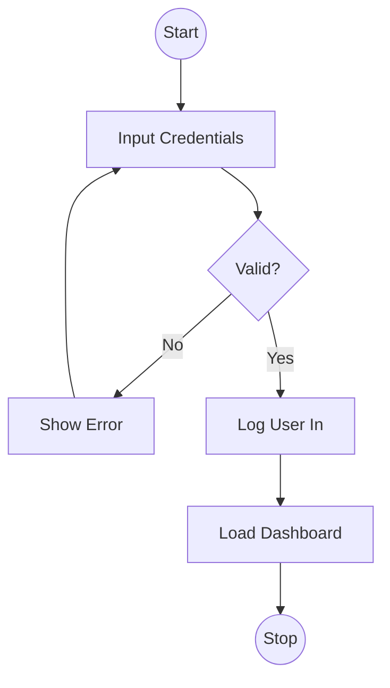

# Activity Diagram

## Type: Behavioral
Shows the flow of control or data from activity to activity. Similar to a **Flowchart**.

## Usage
-   Modeling complex logic (if/else loops).
-   Modeling business workflows (e.g., Order Processing).
-   Supports **concurrency** (fork/join).

## Example (Login Flow)

