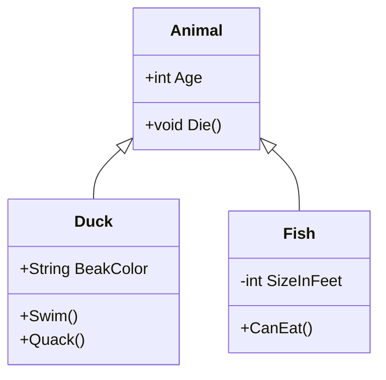

# Class Diagram

## Type: Structural
The most common UML diagram. It shows the static structure of the system: classes, their attributes, methods, and relationships.

## Relationships
-   **Inheritance**: `--->` (Solid line, triangle arrow)
-   **Implementation**: `...>` (Dotted line, triangle arrow)
-   **Association**: `-->` (Solid line, open arrow)
-   **Composition**: `*--` (Sold Diamond)
-   **Aggregation**: `o--` (Empty Diamond)

## Example

