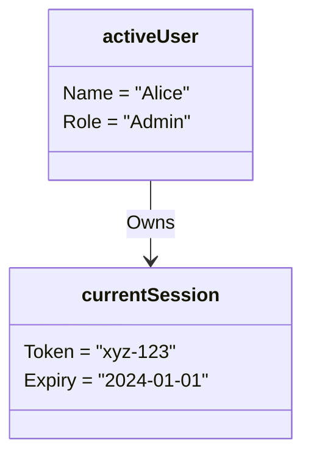

# Object Diagram

## Type: Structural
An Object Diagram is essentially a **Class Diagram** but instantiated at a specific point in time.
It shows "Objects" (instances) instead of "Classes".

## Purpose
-   Debugging: Visualizing the memory state at a breakpoint.
-   Examples: Showing a specific complex relationship (e.g., Circular reference example) that is hard to understand with just a Class diagram.

## Example
If Class Diagram says `Student (1) -- (*) Course`.
Object Diagram shows:
-   `John: Student`
-   `Math: Course`
-   `Physics: Course`
-   `Link: John -> Math`
-   `Link: John -> Physics`

*(Note: UML standard underscores object names `Name:Type`, but in Mermaid we often simulate this).*
