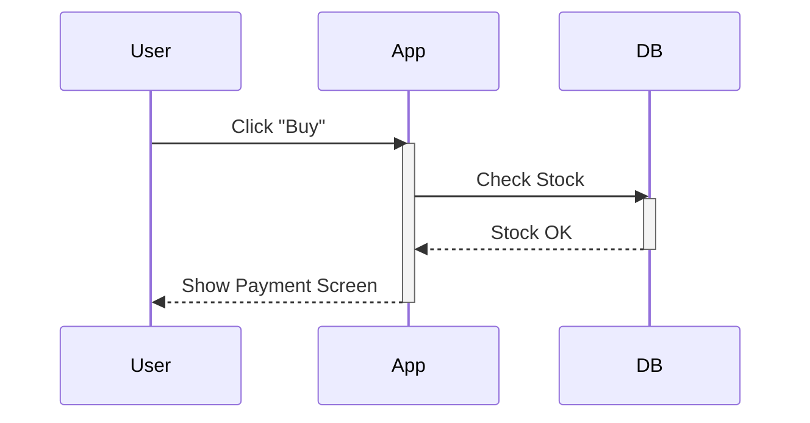

# Sequence Diagram

## Type: Behavioral
Shows object interactions arranged in time sequence. It depicts the objects involved in the scenario and the sequence of messages exchanged between the objects needed to carry out the functionality of the scenario.

## Key Elements
-   **Lifelines**: Vertical dashed lines representing the object's life.
-   **Messages**: Horizontal arrows (Solid = Sync, Dotted = Return/Async).
-   **Activation Bars**: Rectangles showing when an object is active.

## Example (Order Process)

