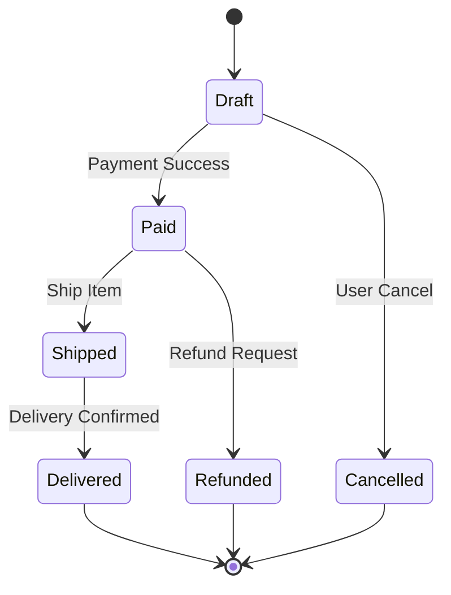

# State Diagram (State Machine)

## Type: Behavioral
Shows the states of a single object, the events or transitions that cause a change in state, and the actions that result from a change in state.

## Usage
-   Objects with complex lifecycles (e.g., `Order`, `GameCharacter`, `TCPConnection`).
-   To ensure invalid transitions are impossible (e.g., can't go from `Refunded` to `Shipped`).

## Example (Order Lifecycle)

